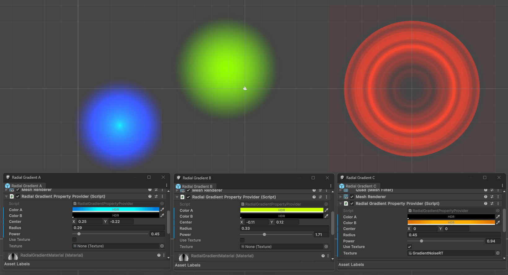
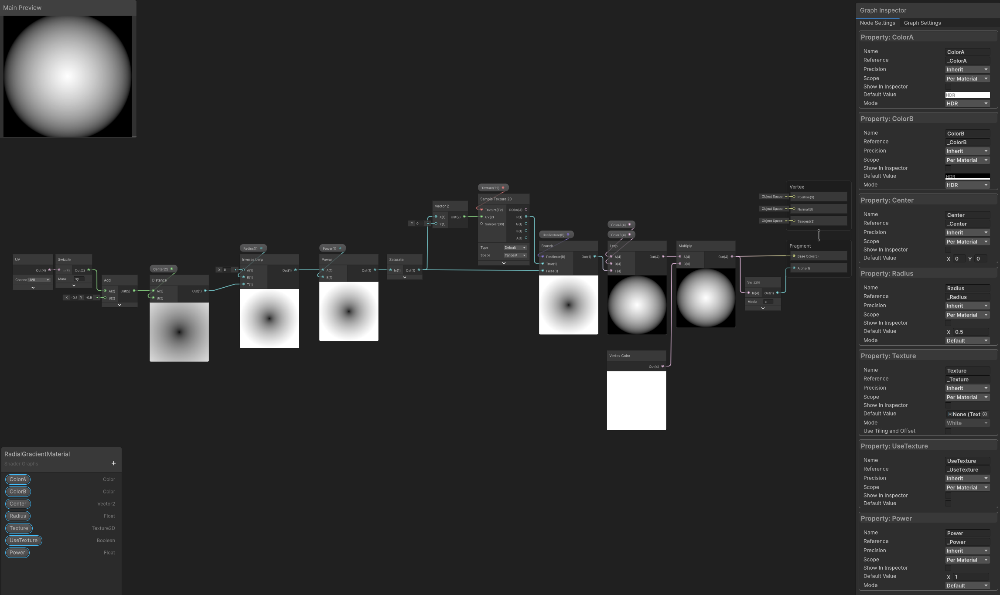
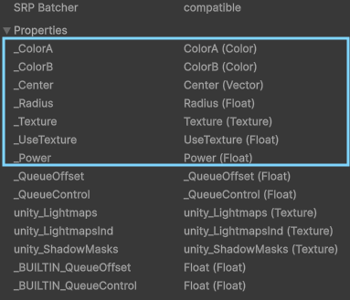

# Material Property Provider

## Problem Statement
### Making _Renderers_ use unique values, without manually creating _Material Variants_
Requires handling _Material Property Blocks_, and/or _Material Instances_ (at _Runtime_ only).
### Assigning values from a _MonoBehaviour_
Requires setting the _Material Property Block_ or _Material_'s properties on ```Start()```, ```OnValidate()```, ```Reset()```, and ```Update()```.
### SRP Batcher Compatibility
Requires using _Material Property Blocks_ when in _Edit Mode_ (not to leak _Materials_ in the _Editor_), but unique _Material Instances_ at _Runtime_.

## Solution
A _MonoBehaviour_ based class that will automatically set its _Renderer_'s _Material Properties_ built from _fields_ and _properties_ marked with _**MaterialProperty**_ _Attribute_.

Derive from ```MaterialPropertyProviderBase``` and decorate _Fields_ and _Properties_ with ```[MaterialProperty("_Reference")]``` **Attributes** to add them to the _Material Properties_ that will automatically be handled.

Supported Types are: bool, float, int, Color, Vector2, Vector3, Vector4, Matrix4x4, Texture, Texture2D, Texture3D, Cubemap, RenderTexture.

Any other type will issue a warning and just be discarded.

## SRP Batcher Compatibility
When using **URP** or **HDRP** with **SRP Batcher Enabled**, **Material Property Blocks** will only be used when in **Edit Mode**.
**Runtime / Play Mode** will then make unique **Material** instances. Make sure your Materials are **compatible** with the SRP Batcher.

## Example
### Radial Gradient
```cs
[ExecuteAlways] // this allows for animated properties preview in Timeline when in Edit Mode
public class RadialGradientPropertyProvider : MaterialPropertyProviderBase
{
#pragma warning disable CS0414
    [SerializeField, ColorUsage(true, true), MaterialProperty("_ColorA")] Color _colorA = Color.yellow;
    [SerializeField, ColorUsage(true, true), MaterialProperty("_ColorB")] Color _colorB = Color.cyan;

    [SerializeField, MaterialProperty("_Center")] Vector2 _center;
    [SerializeField, MaterialProperty("_Radius")] float _radius = .5f;

    [SerializeField, Range(.1f, 5f), MaterialProperty("_Power")] float _power = 1f;

    [SerializeField] bool _useTexture;

    [SerializeField, MaterialProperty("_Texture")] Texture _texture;
#pragma warning restore CS0414

    [MaterialProperty("_UseTexture")]
    public bool UseTexture { get => _useTexture && _texture != null; }
}
```
The component will automatically set the fields' and properties' values in the *Renderer*'s *Material* Properties.






